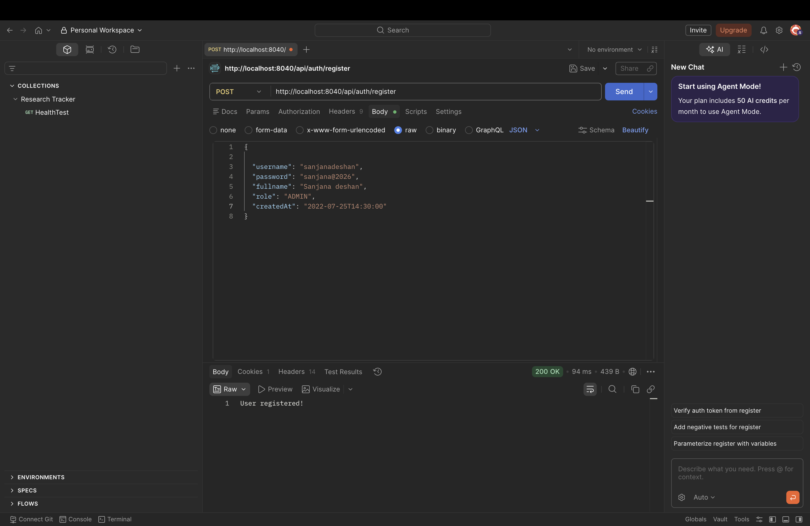
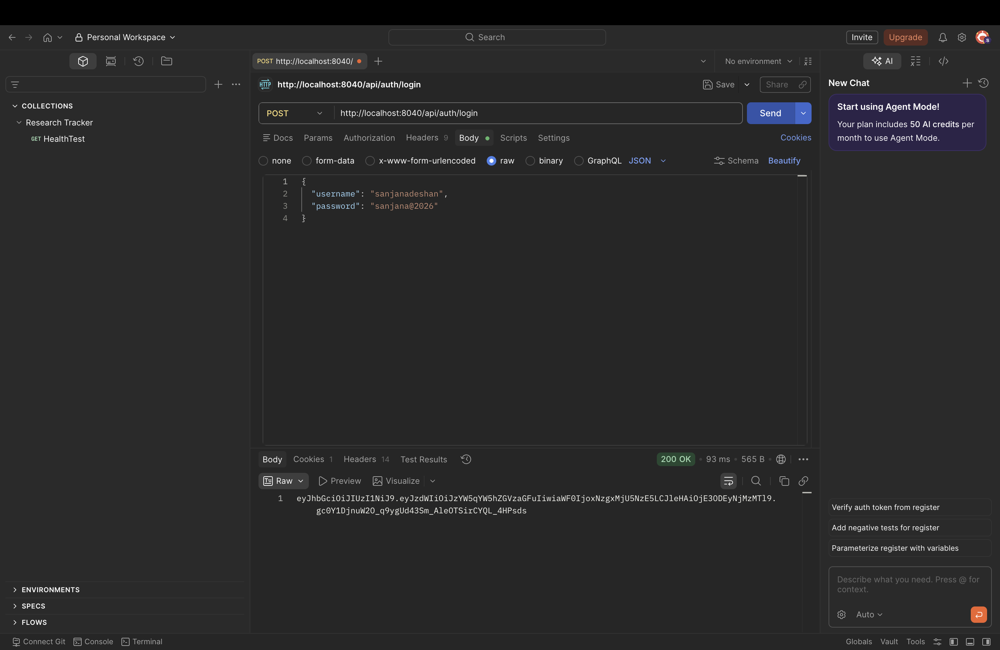

#  Research Project Tracker - Backend

A secure and scalable backend application developed using **Spring Boot**, **Spring Security**, **JWT Authentication**, and **MySQL** for managing academic research projects, milestones, and documents.

##  Features

-  JWT Authentication & Authorization
-  User Registration & Login
-  Role-Based Access Control (ADMIN, PI, MEMBER, VIEWER)
-  Project Management
-  Milestone Management
-  Document Management
-  Password Encryption using BCrypt
-  RESTful API Architecture
-  MySQL Database Integration

---

##  Technology Stack

| Technology | Description |
|------------|-------------|
| Spring Boot | Backend Framework |
| Spring Security | Authentication & Authorization |
| JWT | Secure Token-Based Authentication |
| Spring Data JPA | ORM Layer |
| MySQL | Database |
| Maven | Dependency Management |
| Lombok | Boilerplate Code Reduction |
| Git & GitHub | Version Control |

---

#  System Screenshots

##  User Login Successful



---

# 🔐 Authentication

### User Registration

```http
POST /api/auth/signup
```

### User Login

```http
POST /api/auth/login
```

### Login Request

```json
{
  "username": "user@example.com",
  "password": "password123"
}
```

### Login Response

```json
{
  "token": "eyJhbGciOiJIUzI1NiIs..."
}
```
##  Give Token



---

---

#  User Roles

| Role | Permissions                     |
|--------|-------------------------------|
| ADMIN  | Full System Access            |
| PI     | Manage Own Projects           |
| MEMBER | Manage Milestones & Documents |
| VIEWER | Read Only Access              |

---

#  API Endpoints

## Authentication

| Method   | Endpoint         | Description          |
|----------|------------------|----------------------|
| POST     | /api/auth/signup | Register User        |
| POST     | /api/auth/login  | Login & Generate JWT |

---

## Projects

| Method   | Endpoint                  |
|----------|---------------------------|
| GET      | /api/projects             |
| GET      | /api/projects/{id}        |
| POST     | /api/projects             |
| PUT      | /api/projects/{id}        |
| PATCH    | /api/projects/{id}/status |
| DELETE   | /api/projects/{id}        |

---

## Milestones

| Method   | Endpoint                      |
|----------|-------------------------------|
| GET      | /api/projects/{id}/milestones |
| POST     | /api/projects/{id}/milestones |
| PUT      | /api/milestones/{id}          |
| DELETE   | /api/milestones/{id}          |

---

## Documents

| Method   | Endpoint                     |
|----------|------------------------------|
| GET      | /api/projects/{id}/documents |
| POST     | /api/projects/{id}/documents |
| DELETE   | /api/documents/{id}          |

---

#  Database Configuration

Update `application.properties`:

```properties
spring.datasource.url=jdbc:mysql://localhost:3306/research_tracker
spring.datasource.username=root
spring.datasource.password=

spring.jpa.hibernate.ddl-auto=update
spring.jpa.show-sql=true
```

---

# ⚙️ Installation & Setup

### Clone Repository

```bash
git clone https://github.com/SanjanaAbeysinghe/Research-Project-Tracker-Backend.git
```

### Navigate to Project

```bash
cd Research-Project-Tracker-Backend
```

### Build Project

```bash
mvn clean install
```

### Run Application

```bash
mvn spring-boot:run
```

---

# 📂 Project Structure

```text
src/main/java
│
├── auth
├── user
├── project
├── milestone
├── document
├── config
└── common
```

---

#  Security Features

- JWT Authentication
- Stateless Session Management
- BCrypt Password Encryption
- Role-Based Access Control
- Spring Security Filters
- Unauthorized Access Handling

---

#  Learning Outcomes

This project demonstrates:

- Spring Boot Development
- JWT Security Implementation
- REST API Design
- MySQL Database Integration
- Role-Based Authorization
- Enterprise Backend Architecture

---

#  Developer

**Sanjana Deshan**

GitHub: https://github.com/SanjanaAbeysinghe

---

If you found this project useful, don't forget to star the repository.
